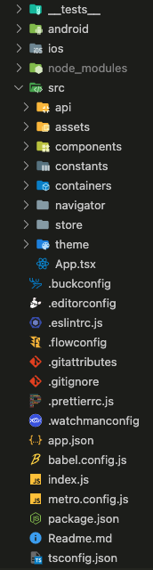

# Rn_Template

This Repo is template for React Native Project

## How To use this template

```
npx react-native init myApp --template https://github.com/poojan010/Rn_Template.git
```

## Dependencies

```
    "dependencies": {
        "@react-native-async-storage/async-storage": "^1.17.7",
        "@react-navigation/bottom-tabs": "^6.3.2",
        "@react-navigation/native": "^6.0.11",
        "@react-navigation/native-stack": "^6.7.0",
        "babel-plugin-module-resolver": "^4.1.0",
        "moment": "^2.29.4",
        "react": "17.0.2",
        "react-native": "0.66.1",
        "react-native-gesture-handler": "^2.5.0",
        "react-native-safe-area-context": "^4.3.1",
        "react-native-screens": "^3.15.0",
        "react-native-vector-icons": "^9.2.0",
        "react-redux": "^8.0.2",
        "redux": "^4.2.0",
        "redux-persist": "^6.0.0",
        "redux-thunk": "^2.4.1"
    }
```

## Folder Structure


